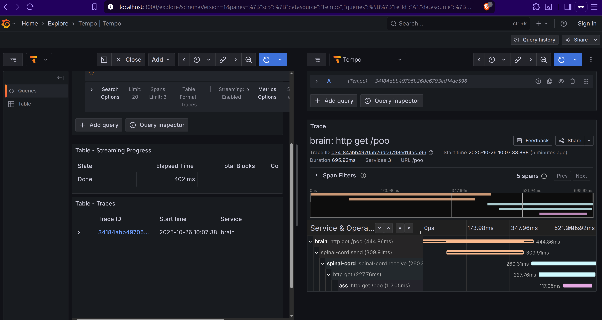

# Nervous System: A Monorepo & SQS Observability Example

This project models a simple biological process using microservices. A request to the `brain` triggers an SQS message,
which the `spinal-cord` processes, causing it to contact the `ass` service, which then completes the operation.

The primary goal is to achieve **end-to-end observability**. We must be able to see a single, unified trace in Grafana
that follows the user's request from the initial API call in `brain`, through the SQS queue, and all the way to the
final API call in `ass`.

---

## The Architecture

### Services

* **`brain` (Port 8080):** Exposes `GET /poo`. Sends a message to an SQS queue.
* **`spinal-cord` (No Inbound Port):** An SQS listener that processes messages from the `spinal-cord` queue. When a
  message is received, it makes an outbound REST call to the `ass` service.
* **`ass` (Port 8082):** The final endpoint. Exposes `GET /poo` and returns a response.

### Infrastructure (Docker Compose)

* **LocalStack:** Emulates AWS SQS for local development without an AWS account.
* **Tempo:** Receives and stores all trace data (spans).
* **Grafana:** Visualizes the traces stored in Tempo.

### Monorepo (Maven)

* A single parent `pom.xml` manages all common dependencies and modules.
* `brain`, `spinal-cord`, and `ass` are individual modules that can be built and run independently but share a common
  parent.

---

## The Monorepo (The POMs)

The project's Maven structure that manages dependencies and subprojects.

* **`nervous-system/pom.xml` (Parent):**
    * `packaging: pom`: Declares this as a parent-only project.
    * `<modules>`: Lists all sub-projects (`brain`, `spinal-cord`, `ass`).
    * `<dependencyManagement>`: Defines the versions of key libraries (like `spring-cloud-aws-dependencies`) for all
      child modules. This ensures `brain` and `spinal-cord` use the exact same SQS library versions.
    * `<dependencies>`: Contains dependencies needed by *all* modules, such as `spring-boot-starter-actuator` and the
      Micrometer/Otel tracing starters.

* **Module POMs (e.g., `brain/pom.xml`):**
    * `<parent>`: This block links the module to the `nervous-system` parent, inheriting its configuration.
    * The `<relativePath>` tag is omitted, forcing Maven to use the local parent `pom.xml` from the root
      directory during a build.

---

## The Infrastructure (Docker Compose)

The `docker-compose.yml` file defines the infrastructure required to run the services.

* **LocalStack:** The `init-aws.sh` script runs on container startup to automatically create the `spinal-cord` queue.
* **Tempo:** Ports `4317` (gRPC) and `4318` (HTTP) are exposed for OTLP trace ingestion.
* **Grafana:** The `grafana-datasources.yml` file is mounted to automatically provision the Tempo data source on
  startup.

---

## End-to-End Tracing (HTTP -> SQS -> HTTP)

This is the hard part. Propagating a trace context across an asynchronous boundary (like an SQS queue) is non-trivial
and requires specific configuration.

### `brain` (The Sender)

1. A request hits the `brain`'s `GET /poo` endpoint.
2. Micrometer Tracing (from `spring-boot-starter-web` and `micrometer-tracing-bridge-otel`) creates a new trace and
   span.
3. The injected `SqsTemplate` is used to send a message.
4. For the `SqsTemplate` to automatically inject trace headers (like `traceparent`) into the SQS message attributes, it
   must be instrumented. This instrumentation is provided by `spring-cloud-aws-starter-sqs` and is automatically enabled
   when `micrometer-tracing-bridge-otel` is on the classpath. We need to set `spring.cloud.aws.sqs.observation-enabled`
   to `true`.

### `spinal-cord` (The Messenger/Listener)

This service is an SQS listener and a REST client. This is where the trace is most often lost.

1. An SQS message (with the `traceparent` attribute) arrives.
2. The `@SqsListener` attempts to receive it.
3. For the listener to successfully read the `traceparent` attribute and continue the trace:
    * **Configuration:** The `spinal-cord/application.properties` must contain
      `spring.cloud.aws.sqs.observation-enabled` to `true`.
    * **Signature:** The listener method *must* accept `org.springframework.messaging.Message<String>` (or
      `Message<MyPojo>`), not just the `String` payload.

**Why this is Required:**

- The `Message<T>` gives us access to the message's **headers**, which is where the SQS attributes (containing the
  `traceparent`) live. If we only listen for `String`, the headers are discarded before the wrapper can read them, and
  the trace breaks.

### `ass` (The Final Endpoint)

1. Now that the `spinal-cord` service has successfully continued the trace, its `SqsListener` method runs inside the
   original trace context.
2. It uses the injected `RestClient` to call the `ass` service.
3. Spring Boot's default auto-instrumentation for `RestClient` sees the active trace and automatically adds the
   `traceparent` HTTP header to the outbound `GET /poo` request.
4. The `ass` service receives this request, sees the HTTP header, and correctly continues the same trace, completing the
   end-to-end flow.

-----

## How to use it.

The primary goal is to play with a monorepo and observability, so this project lacks of testing and other important
things, so don't think about this repository as something production ready.

Follow these steps to build and run the entire system.

### Start the Infrastructure

First, we need to run the `docker-compose.yml` file to start LocalStack, Tempo, and Grafana.

In the `/docker` directory, start the containers:

```bash
 docker compose up
```

### Compile the Monorepo

Next, we need to build all the Maven modules (`brain`, `spinal-cord`, `ass`) from the project root.

- Navigate to the root `nervous-system` directory (the one with the parent `pom.xml`).

- In the root folder (where the parent `pom.xml`is ) we need to run the Maven `install` command. This builds each module
  and installs it into the local `.m2` repository.

```bash
   mvn clean install
```

### Run the Services

We must run each Spring Boot application in its own terminal.

* **Terminal 1: Run `ass`**

  ```bash
  mvn -pl ass spring-boot:run
  ```

* **Terminal 2: Run `spinal-cord`**

  ```bash
  mvn -pl spinal-cord spring-boot:run
  ```

* **Terminal 3: Run `brain`**

  ```bash
  mvn -pl brain spring-boot:run
  ```

### Trigger the Flow

Once all three services are running, we send a request to the `brain` service:

```bash
curl http://localhost:8080/poo
```

You will see the logs chain through all three terminals, and the `traceId` in the logs will be identical across all
services. That curl will return the traceId.

* **Curl**

```text
{"id":"034184abb49705b26dc6793ed14ac596","messageContent":"I want to poo"}
```


* **Brain**

```text
2025-10-26T10:07:38.987+01:00  INFO 156681 --- [brain] [nio-8080-exec-1] [034184abb49705b26dc6793ed14ac596-92633955070b5c86] i.g.d.brain.controller.BrainController   : Received request in 'brain'. Sending SQS message...
2025-10-26T10:07:39.304+01:00  INFO 156681 --- [brain] [nio-8080-exec-1] [034184abb49705b26dc6793ed14ac596-92633955070b5c86] i.g.d.brain.controller.BrainController   : Message sent to SQS.
```

* **Spinal Cord**

```text
2025-10-26T10:07:39.350+01:00  INFO 156738 --- [spinal-cord] [ntContainer#0-1] [034184abb49705b26dc6793ed14ac596-61423f522d06458e] i.g.d.spinalcord.listener.SqsListener    : 'vertebral-spine' received message: I want to poo
2025-10-26T10:07:39.350+01:00  INFO 156738 --- [spinal-cord] [ntContainer#0-1] [034184abb49705b26dc6793ed14ac596-61423f522d06458e] i.g.d.spinalcord.listener.SqsListener    : Calling 'ass' service...
2025-10-26T10:07:39.592+01:00  INFO 156738 --- [spinal-cord] [ntContainer#0-1] [034184abb49705b26dc6793ed14ac596-61423f522d06458e] i.g.d.spinalcord.listener.SqsListener    : 'ass' service responded with: '{"id":"034184abb49705b26dc6793ed14ac596","messageContent":"I poo"}'
```

* **Ass**

```text
2025-10-26T10:07:39.532+01:00  INFO 156773 --- [ass] [nio-8082-exec-1] [034184abb49705b26dc6793ed14ac596-3bf7d17d3ecd1e67] i.g.d.ass.controller.AssController       : 'ass' service received request... responding with 'poo'
```

### See the Trace

1. Open Grafana in the browser: `http://localhost:3000`
2. Go to the **Explore** page (compass icon).
3. Select the **Tempo** data source.
4. Go to the **Search** tab and run a query. We will see the `brain` trace.
5. Click on the trace to see the full, end-to-end flame graph showing `brain` -\> `spinal-cord` -\> `ass`.

