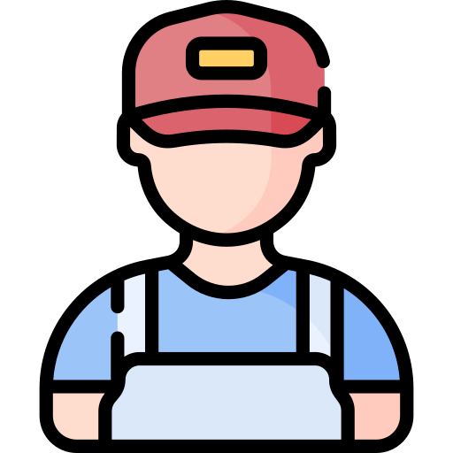
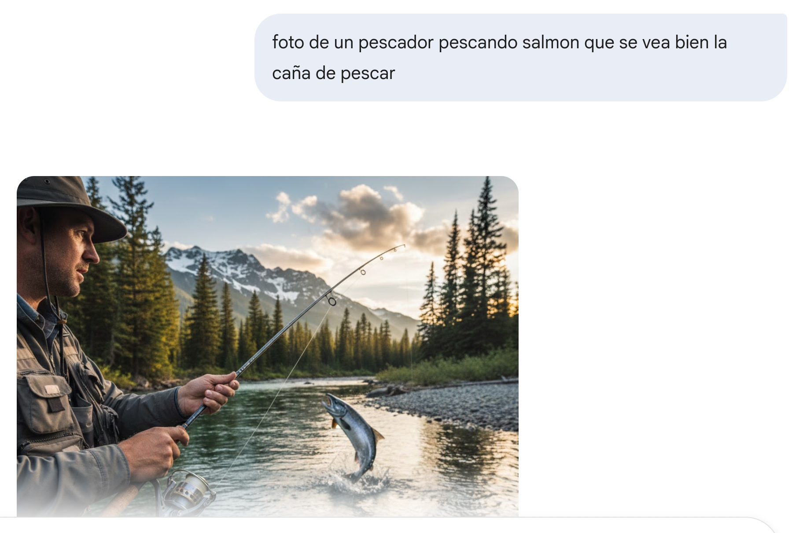
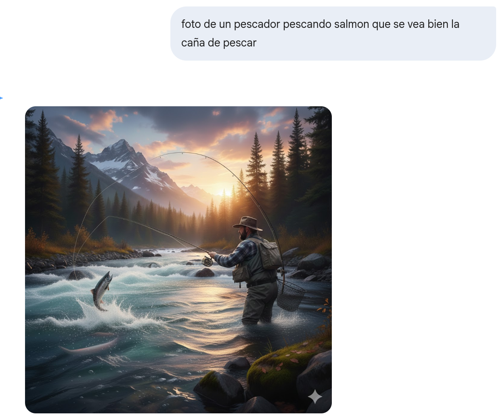
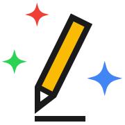
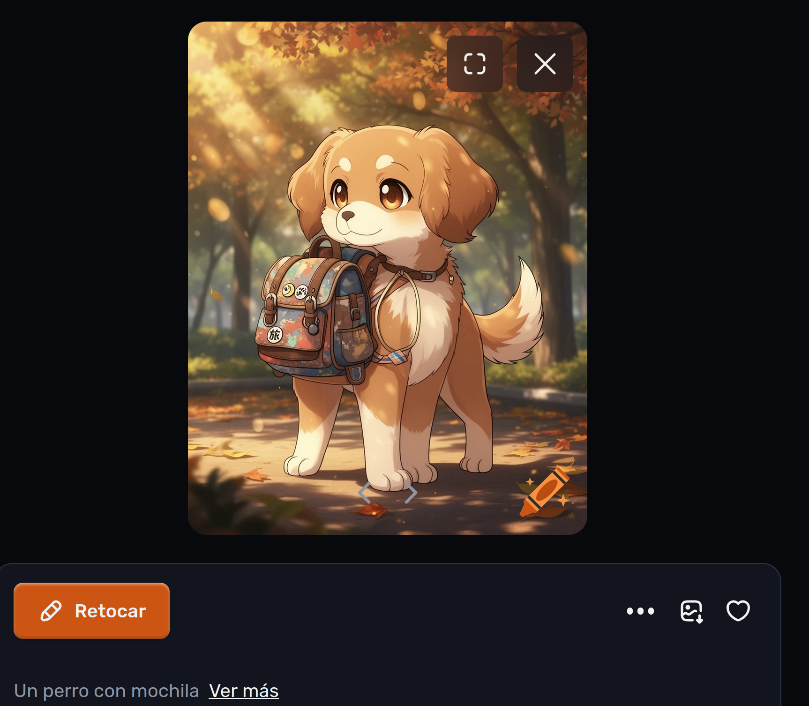
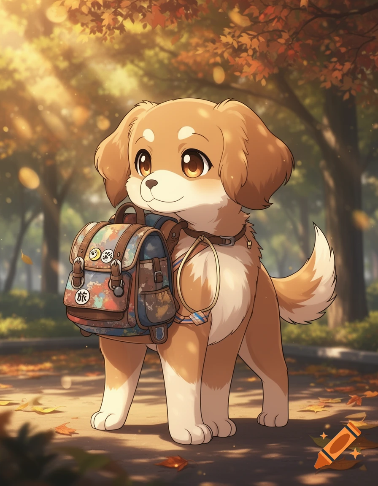
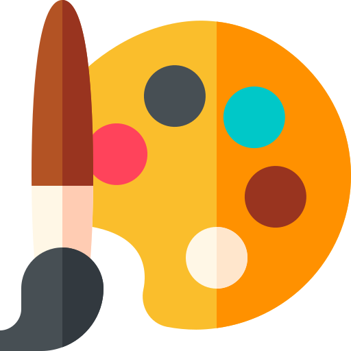

# 🤖 Mi Nueva Amiga la IA 
### ¡Bienvenidos, Exploradores!

---

# 🚩 Misión de Hoy

1. **¿Qué es la IA?** (Nuestro mapa) 🗺️
2. **El Lápiz Mágico** (AutoDraw) ✍️
3. **La Fábrica de Ideas** (Craiyon) 🖼️
4. **Seguridad** (El semáforo) 🚦
5. **Galería de Arte** (Ver los dibujos) 🌟

---

# 👋 ¿Qué es la IA?
### Es nuestro ayudante mágico

* Nos ayuda a **dibujar** muy bien.
* Nos ayuda a **pensar** ideas nuevas.
* ¡Es como un pincel que sabe qué quieres pintar!

---

# 👋 ¿Qué es la IA?
### A veces nos dibuja cosas que no son correctas... 🤪
(Sujeción de la caña, mirada del pescador, pez como si estuviera capturado pero no.)

---

# 👋 ¿Qué es la IA?
### ¡Se puede inventar cosas raras!
(Dos cañas de pescar, una flota)

---

# ✍️ Superpoder 1: AutoDraw 
### (www.autodraw.com)

1. Haz un dibujo sencillo con el ratón.
2. Mira los dibujos que salen **arriba**.
3. Haz clic en el que más te guste.

---

# 🖼️ Superpoder 2: Craiyon 
### (www.craiyon.com)

1. Piensa una idea: **"Un perro con mochila"**.
2. Escribe la frase en el cuadro blanco.
3. Pulsa el botón naranja **"DRAW"**. 🟠
4. ¡Espera a que la IA termine el dibujo! ⏳

---

# 🖼️ Craiyon: Un perro con mochila 

---

# 🖼️ Un perro con mochila, ¿algo raro 🤪?

---

# 🚦 El Semáforo de Seguridad

* 🟢 **VERDE:** Crear, aprender y divertirse mucho.
* 🟡 **AMARILLO:** Si sale algo raro, avisa a un adulto.
* 🟡 **AMARILLO:** A veces la IA se equivoca o inventa cosas.
* 🔴 **ROJO:** No pongas nombres, direcciones o secretos.
* 🔴 **ROJO:** Nunca pongas fotos tuyas o de tus amigos.

---

# 🌟 Galería de Arte

* Vamos a ver vuestros dibujos favoritos.
* Aplaudimos a todos los artistas. 👏
* Guardamos nuestra hoja en la mochila. 🎒

---

# 🏆 Misión Finalizada
### ¡Eres un gran Explorador!

